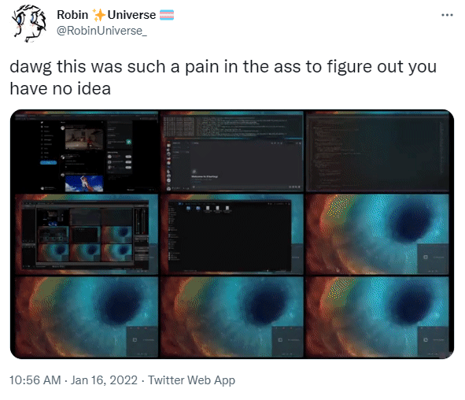

<h1>TwitFix Extension</h1>

This is a pretty cool browser Extension made by [Doruk](https://github.com/DorukSega) that simply adds the option to copy a TwitFix link to your clipboard when right clicking any given video on twitter

[Get it on Firefox](https://addons.mozilla.org/en-US/firefox/addon/twitfix-extension/) • Get it on Chrome (Coming soon!)

This extension is currently undergoing review on the Chrome and Firefox extension stores, but once those are complete I will provide install links here :)

This project is licensed under the [WTFNONPL](https://github.com/robinuniverse/WTFNONPL)

